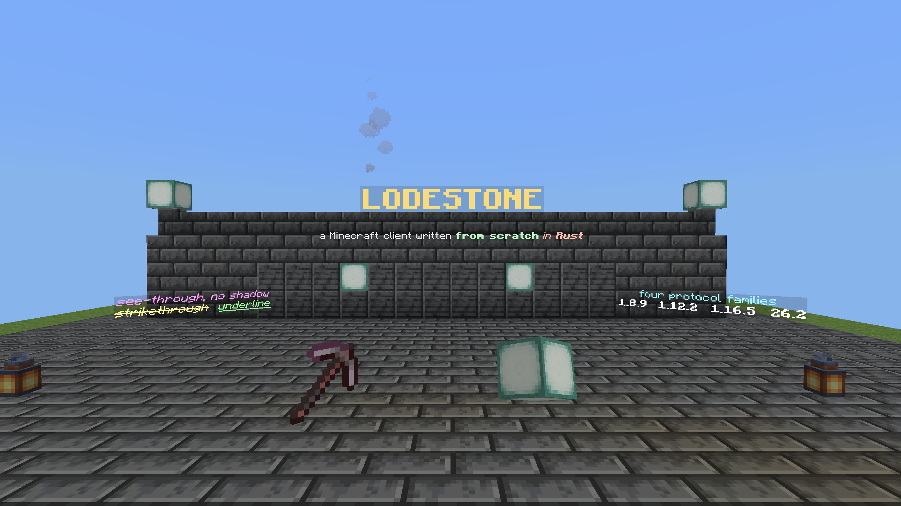
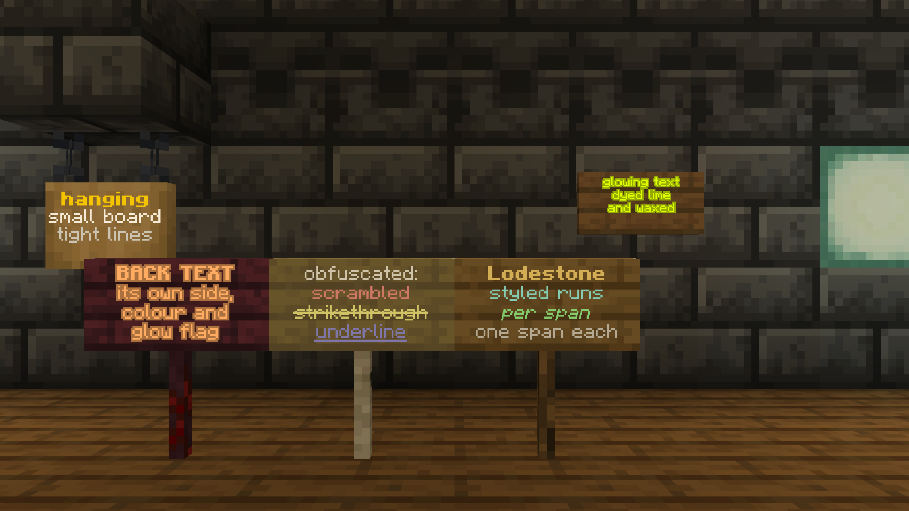
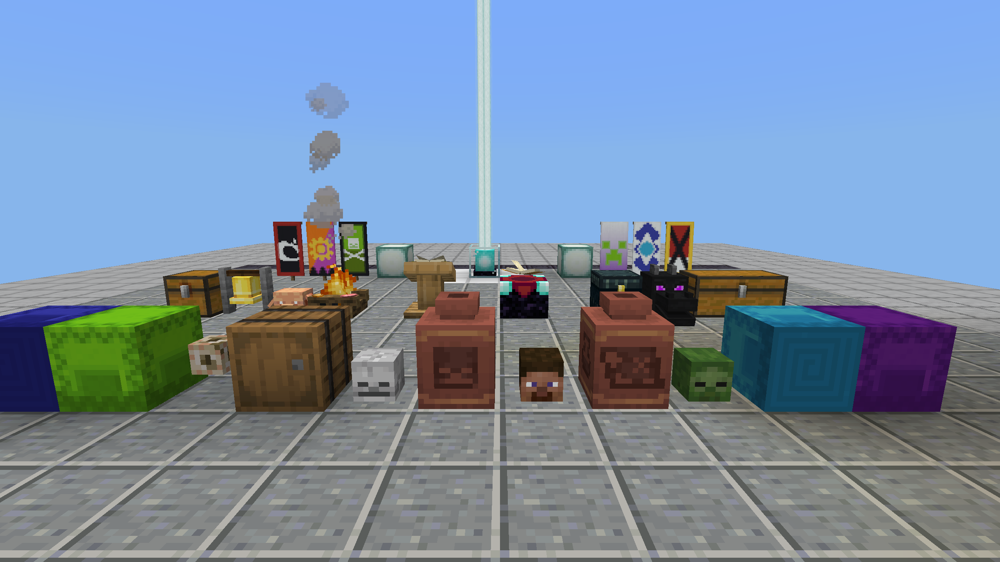
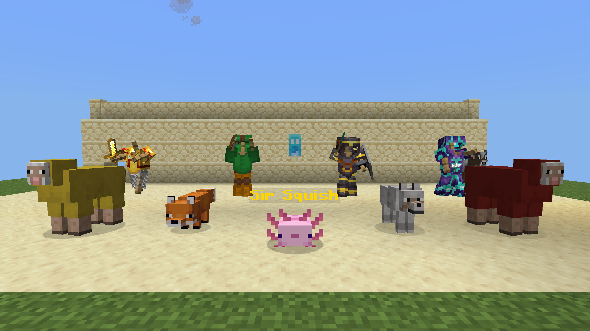
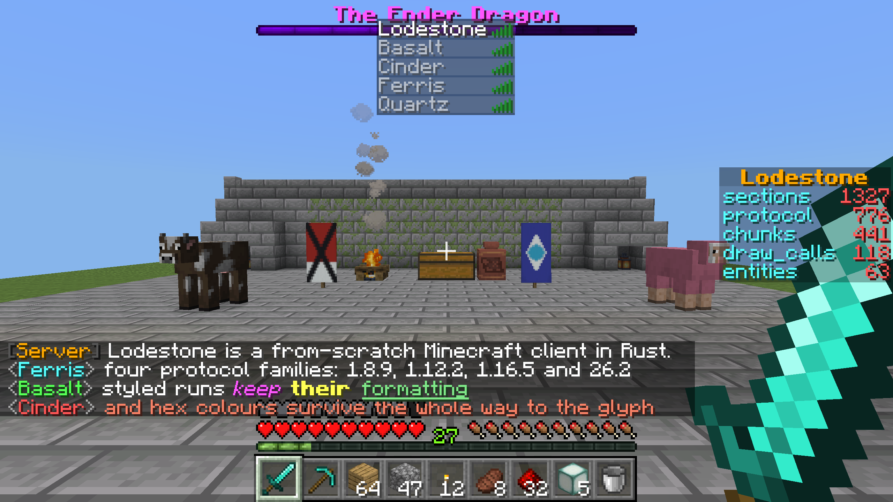

# Lodestone

A Minecraft-compatible client written from scratch in Rust — renderer, physics, networking,
world generation — plus an integrated server it can host from. No Mojang code is used or
redistributed; everything is ported from the published protocol, the decompiled reference
under `.cache/` (never checked in — see [`docs/legal-notices.md`](./docs/legal-notices.md)),
and Mojang's own data generators.

> [!NOTE]
> **AI was used extensively to write this code.** A from-scratch client is far more code
> than one person can write by hand in any reasonable time, so the bulk of it was authored
> with AI assistance. It has been read over closely and playtested by hand — the bugs that
> shaped most of it were found by actually playing on real servers, not by a model deciding
> it was finished.

> [!IMPORTANT]
> **Lodestone is not affiliated with, endorsed by, or associated with Mojang Studios,
> Microsoft, or Minecraft in any way.** "Minecraft" is a trademark of Mojang Synergies AB.
> This is an independent, unofficial project; see
> [`docs/legal-notices.md`](./docs/legal-notices.md) for what that means for licensing,
> third-party design references, and data sources.

## In game

Every image below is this client rendering a live session against a real vanilla 26.2
server — no mock-ups, no compositing. They are captured by `just screenshots`, which joins
the flat creative oracle, builds each scene over RCON and renders one frame through the same
path the windowed client uses; see [`docs/screenshots.md`](./docs/screenshots.md).

| | |
|---|---|
|  **`text_display` holograms** — styled, shadowed and panelled world text, plus `block_display` and `item_display` beside it. |  **Signs** — per-span colour, bold, italic, obfuscated, strikethrough and underline; glowing dye; standing, wall and hanging boards; and one sign turned round to show its separate back text. |
|  **Block entities** — layered loom banners, decorated pots with four independent sherds, chests and shulker boxes, a cooking campfire, a lectern's book, a bell, an enchanting table and a beacon beam. |  **Entities** — armour stands in six-rotation poses wearing trimmed diamond, netherite and gold, dyed leather, a patterned shield, plus variant mobs and a custom name plate. |
|  **The HUD** — tab list, scoreboard sidebar, boss bar, styled chat with hex colour, hearts, hunger, armour and XP, 3-D block items in the hotbar, and the first-person hand. | |

## Goals

- **Play the real game against real servers.** Not a protocol library or a bot framework —
  a client you can join a vanilla server with and play.
- **Be a server too.** The same binary hosts singleplayer and opens a world to LAN, running
  the full simulation in-process rather than shelling out to a Java server.
- **Multi-version by construction.** Joining is a *version* problem, not a fork. Each
  protocol family is a workspace member behind a feature flag, and the shell compiles with
  none of them enabled — the seam is enforced by a build, not by convention.
- **Port from the record, not from memory.** Behaviour is derived from the decompiled
  source and from captured bytes, and gates take their expected values from outside our own
  implementation wherever one exists.
- **Run in a browser.** `wasm32-unknown-unknown` is a first-class target, including the
  integrated server.

## Version support

Two different questions — which versions we can **join**, and which we can **host**.

| Family | Protocol | Minecraft | Join | Host | Clientbound decoded | Serverbound encoded |
|---|---|---|---|---|---|---|
| `v47`  | 47  | 1.8.9  | yes | no  | 59/74   | 21/26 |
| `v340` | 340 | 1.12.2 | yes | no  | 62/80   | 24/33 |
| `v735` | 754 | 1.16.5 | yes | no  | 54/92   | 25/48 |
| `v770` | 776 | 26.2   | yes | yes | **141/141** | 68/69 |

Hosting additionally needs the serverbound direction decoded: `v770` decodes **66/69** and
connects **47/69** to real behaviour, with 19 decoded packets still landing only on an
ignored arm.

Counts are produced by `cargo xtask connectedness`, which walks each family's packet-id
tables — run it rather than trusting this table, which is a snapshot. Note `v735` speaks
protocol **754**, not 735; the folder name is not the protocol number, so ask
`VersionAdapter::supports` rather than deriving it.

Only `v770` implements the server side, so 26.2 is the only version we can host. Legacy
families map their packets into the canonical 26.2 world model, so the renderer and
simulation are version-agnostic.

## What works

Singleplayer generates real terrain — biomes, caves, ore veins, vegetation and structures —
and simulates mobs with per-species AI, spawning, breeding and taming, redstone, fluids,
containers and crafting, combat and damage, hunger, experience, day/night, weather, and the
Nether with working portals. Worlds persist to the vanilla region format, including entities
and points of interest. A world can be opened to LAN without restarting it.

The client draws the world with the vanilla model and lighting pipeline, resource packs
included, and joins real servers in offline or online mode.

This is a work in progress and the gaps are real. `cargo xtask connectedness` is the honest
measure of protocol coverage; open issues track the rest.

## Building

```bash
just run          # play — cargo run --release -p lodestone-shell --bin lodestone
just health       # the four required checks, in order
just run-wasm     # the browser build, on :8080 (release is mandatory there)
```

The binary is `lodestone`, not `lodestone-shell`.

## Reading further

- [`CLAUDE.md`](./CLAUDE.md) — the working rules, and the hazards behind each one
- [`DESIGN.md`](./DESIGN.md) — architecture, and §12's log of measurements that overturned
  a confidently held belief
- [`docs/`](./docs/README.md) — one document per subsystem
