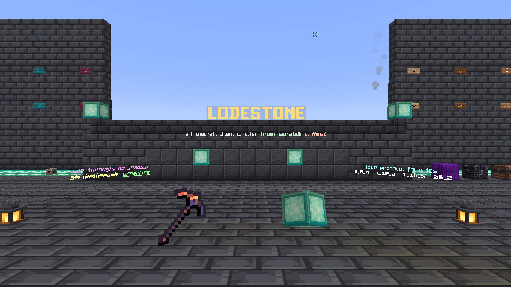
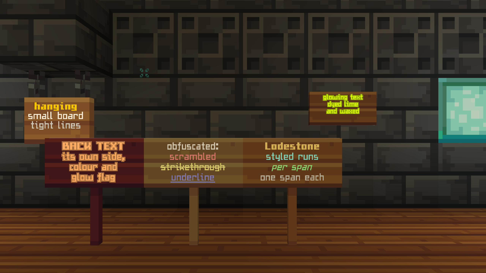
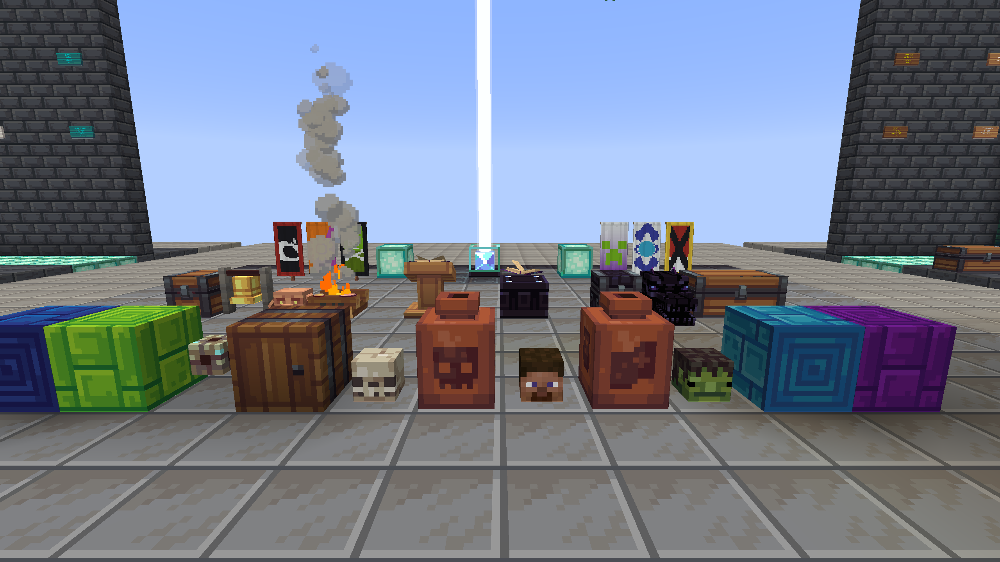
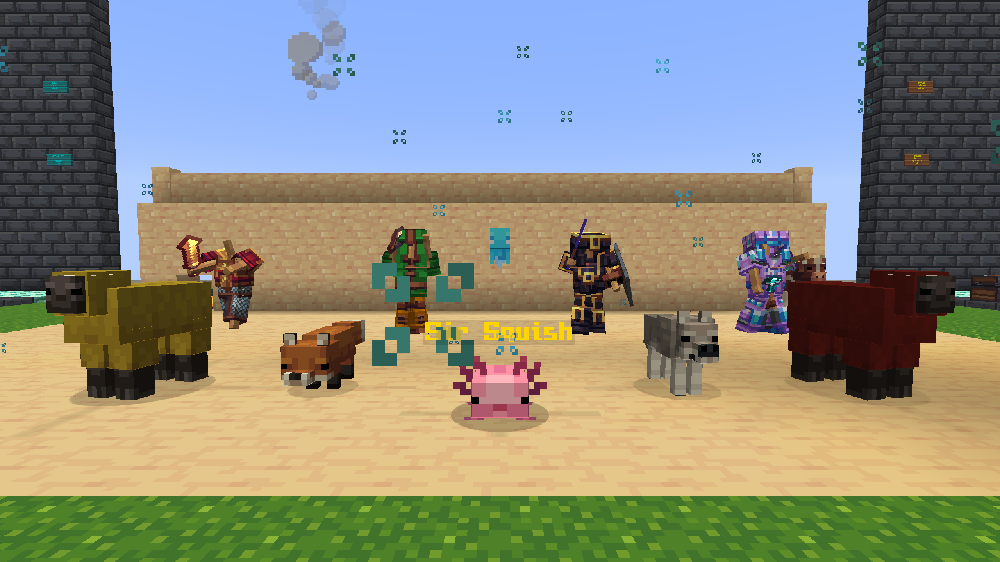
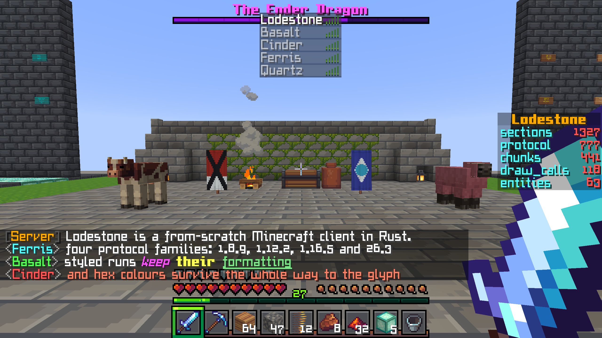

# Lodestone

Lodestone is a Minecraft Java Edition client written from scratch in Rust, with its own
integrated server for singleplayer. It renders with wgpu, and there is an experimental browser build.

It targets Minecraft 26.3. A default build joins 26.3 and 26.2 servers. Older protocol families
can be compiled in, and together they reach every release back to 1.7.10. Singleplayer worlds are
generated and served at 26.3 (protocol 777), and are meant to match what the real game makes from
the same seed. Terrain, biomes and decoration are checked against the real server, chunk for chunk.

The game is a thin shell over a library. Anything the window can do, a program can do headlessly,
so the same code drives a bot or a test.

Lodestone is unfinished, and you will find bugs and places where it behaves differently from
Minecraft.

## Screenshots

All taken in Lodestone, connected to a local Minecraft server.

| | |
|---|---|
|  |  |
|  |  |



## Running it

There are no prebuilt releases yet, so you build it yourself. You need
[Rust](https://rustup.rs/) and [`just`](https://github.com/casey/just). On Debian or Ubuntu, also
run `sudo apt install libasound2-dev pkg-config`.

```sh
git clone https://github.com/matteopolak/lodestone.git
cd lodestone
cargo run -p xtask -- fetch-assets --version "$(cat mc-version)"
just run
```

`fetch-assets` downloads the game's own assets for the release named in `mc-version`. Lodestone
ships none of them. The repository pins its Rust toolchain, and the first build is slow.

The main menu offers singleplayer and multiplayer. To go straight to a server instead:

```sh
just run --host example.org --port 25565
```

The browser build has its own [setup instructions](./web/README.md).

If something breaks, please [open an issue](https://github.com/matteopolak/lodestone/issues).

## Working on it

[`docs/`](./docs/README.md) has one page per subsystem, and
[`docs/architecture.md`](./docs/architecture.md) explains how they fit together.

## License

Lodestone's own code is licensed under the
[GNU General Public License, version 3 or later](./LICENSE) (`GPL-3.0-or-later`).

Lodestone is not affiliated with Mojang Studios or Microsoft. Attribution and licensing details are
in [`docs/legal-notices.md`](./docs/legal-notices.md).

## AI use

Lodestone is built largely with AI coding agents.
